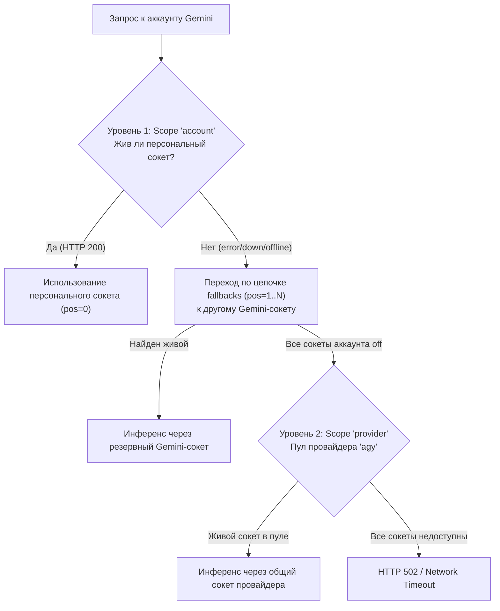

# Скилл: Оркестрация кластера исследовательских сабагентов в OmniRoute

Этот скилл предназначен для управления пулом рабочих узлов (сабагентов) Gemini и Claude в балансировщике OmniRoute (`http://127.0.0.1:20128`), привязки независимых сетевых сокетов (1081–1085), настройки многоуровневой отказоустойчивости сетевых туннелей и бесперебойного Round-Robin инференса для сравнительного бенчмаркинга.

---

## Научная гипотеза
Экспериментальная проверка гипотезы: «Способен ли ансамбль специализированных сабагентов превзойти монолитные модели по показателям точности, отказоустойчивости и пропускной способности при решении комплексных задач?».

---

## Критические архитектурные правила и особенности

1. **Калибровка сетевых вызовов в WSL (Bypass Proxy):**
   При вызове локальных эндпоинтов OmniRoute (`127.0.0.1:20128`) curl и библиотеки Python (`urllib`, `requests`) по умолчанию перехватывают переменные `http_proxy` / `all_proxy` из окружения WSL и пытаются направить запрос через внешние SOCKS5-прокси, что приводит к ошибке `HTTP 502 Bad Gateway`.
   - В curl **всегда** передавайте флаг `--noproxy '*'`:
     ```bash
     curl --noproxy '*' -s http://127.0.0.1:20128/v1/models -H "Authorization: Bearer sk-omniroute-secret"
     ```
   - В Python создавайте opener с отключенным прокси:
     ```python
     import os, urllib.request
     os.environ['no_proxy'] = '*'
     opener = urllib.request.build_opener(urllib.request.ProxyHandler({}))
     ```

2. **Zero-Trust Token Vault (Herdr):**
   В системе Herdr токены профилей на диске зашифрованы по стандарту AES-256-GCM (`antigravity-oauth-token.enc`).
   - Чтение токенов для синхронизации с OmniRoute должно производиться строго внутри контекстного менеджера:
     ```python
     import token_vault_manager
     with token_vault_manager.auto_unlock_context():
         # чтение открытого json-токена
     ```

3. **Шифрование учетных данных OmniRoute (`enc:v1:`):**
   База данных OmniRoute (`storage.sqlite`) требует, чтобы поля `access_token`, `refresh_token` и `api_key` в таблице `provider_connections` были зашифрованы с помощью мастер-ключа `STORAGE_ENCRYPTION_KEY` (из `~/.omniroute/.env`).
   - Прямая запись незашифрованного токена приводит к падению OmniRoute при расшифровке.
   - Для шифрования используется модуль Node.js:
     ```javascript
     import { encryptCredential } from '/home/f/.local/lib/node_modules/omniroute/bin/cli/encryption.mjs';
     const encrypted = encryptCredential(rawToken); // возвращает enc:v1:<iv>:<ciphertext>:<tag>
     ```

4. **Блокировка базы данных SQLite через UNC (Windows ➔ WSL):**
   Категорически запрещено открывать `storage.sqlite` напрямую из Windows через UNC-путь `\\wsl$\Ubuntu\...` при работающем сервере OmniRoute. Это вызывает фатальную блокировку `sqlite3.OperationalError: database is locked`. Все операции с БД должны выполняться строго внутри окружения WSL2.

5. **Горячая перезагрузка демона OmniRoute:**
   Сервер OmniRoute кеширует провайдеров и маршруты в оперативной памяти (процесс в tmux `omniroute`). После любых прямых правок в `storage.sqlite` требуется мягкий перезапуск:
   ```bash
   omniroute restart
   ```

---

## Многоуровневая отказоустойчивость сети сокетов (Multi-Tier Socket Resilience)

Для каждого узла Gemini действует двухуровневая стратегия маршрутизации. Если выделенный сокет профиля недоступен, отключён или в нём пропал интернет, аккаунт **автоматически переключается на любой другой рабочий Gemini-сокет** из пула.



### Архитектура уровней:
1. **Уровень 1: Персональная цепочка с приоритетом (`scope = 'account'`)**
   - На позиции `position = 0` назначается основной персональный сокет профиля (например, `:1084` для Putative, `:1083` для Nagware, `:1082` для Dalliance).
   - На позициях `position = 1..N` регистрируются все остальные существующие сокеты Gemini как резервные (failover candidates).
   - Внутренний механизм OmniRoute `fetchAlivePoolRows` с предикатом `PROXY_ALIVE_PREDICATE` фильтрует неработающие сокеты и мгновенно перенаправляет трафик на следующий живой сокет.

2. **Уровень 2: Общепровайдерский резервный пул (`scope = 'provider', scope_id = 'agy'`)**
   - В `proxy_assignments` регистрируются все сокеты стенда под `scope = 'provider'`.
   - Если для аккаунта исчерпаны все сокеты уровня 1, механизм `resolveProxyForConnectionFromRegistry` автоматически подхватывает любой живой сокет из пула провайдера `agy`.

---

## Скрипт автоматического подключения узла и настройки отказоустойчивых сокетов

Запустите скрипт синхронизации внутри WSL2:

```python
import sqlite3, json, uuid, datetime

conn = sqlite3.connect('/home/f/.omniroute/storage.sqlite', timeout=15)
cur = conn.cursor()

# 1. Регистрация всех SOCKS5 сокетов в proxy_registry
gemini_proxies = [
    ('proxy_gemini_1081', 'Gemini SOCKS5 (:1081)', 'socks5', '127.0.0.1', 1081),
    ('proxy_gemini_1082', 'Gemini SOCKS5 (:1082)', 'socks5', '127.0.0.1', 1082),
    ('proxy_gemini_1083', 'Gemini SOCKS5 (:1083)', 'socks5', '127.0.0.1', 1083),
    ('proxy_gemini_1084', 'Gemini SOCKS5 (:1084)', 'socks5', '127.0.0.1', 1084),
]

unix_now = str(int(datetime.datetime.now().timestamp()))
for pid, pname, ptype, phost, pport in gemini_proxies:
    cur.execute("SELECT id FROM proxy_registry WHERE id = ?", (pid,))
    if not cur.fetchone():
        cur.execute("""
            INSERT INTO proxy_registry (id, name, type, host, port, status, created_at, updated_at, source, family)
            VALUES (?, ?, ?, ?, ?, 'active', ?, ?, 'manual', 'auto')
        """, (pid, pname, ptype, phost, pport, unix_now, unix_now))

# 2. Настройка отказоустойчивых цепочек для каждого аккаунта (Tier 1)
cur.execute("SELECT id, name, email FROM provider_connections WHERE provider = 'agy' AND is_active = 1")
agy_conns = cur.fetchall()

all_proxy_ids = [p[0] for p in gemini_proxies]

for conn_id, name, email in agy_conns:
    # Определяем приоритетный сокет по имени или конфигу
    primary = next((pid for pid in all_proxy_ids if pid.split('_')[-1] in name), all_proxy_ids[0])
    
    cur.execute("DELETE FROM proxy_assignments WHERE scope = 'account' AND scope_id = ?", (conn_id,))
    
    # Приоритет 0: Основной сокет
    cur.execute("""
        INSERT INTO proxy_assignments (proxy_id, scope, scope_id, position, created_at, updated_at)
        VALUES (?, 'account', ?, 0, datetime('now'), datetime('now'))
    """, (primary, conn_id))
    
    # Приоритеты 1..N: Резервные сокеты пула
    pos = 1
    for fallback_id in all_proxy_ids:
        if fallback_id != primary:
            cur.execute("""
                INSERT INTO proxy_assignments (proxy_id, scope, scope_id, position, created_at, updated_at)
                VALUES (?, 'account', ?, ?, datetime('now'), datetime('now'))
            """, (fallback_id, conn_id, pos))
            pos += 1

# 3. Настройка общепровайдерского пула (Tier 2)
cur.execute("DELETE FROM proxy_assignments WHERE scope = 'provider' AND scope_id = 'agy'")
for pos, pid in enumerate(all_proxy_ids):
    cur.execute("""
        INSERT INTO proxy_assignments (proxy_id, scope, scope_id, position, created_at, updated_at)
        VALUES (?, 'provider', 'agy', ?, datetime('now'), datetime('now'))
    """, (pid, pos))

# 4. Регистрация недостающих узлов в ансамбле gemini-farm
cur.execute("SELECT id, data FROM combos WHERE name = 'gemini-farm'")
row = cur.fetchone()
if row:
    combo_id, combo_data = row[0], json.loads(row[1])
    existing_ids = {m['connectionId'] for m in combo_data['models']}
    added = 0
    for conn_id, name, email in agy_conns:
        if conn_id not in existing_ids:
            model_num = len(combo_data['models']) + 1
            combo_data['models'].append({
                'id': f'gemini-farm-model-{model_num}-agy-gemini-pro-agent-{conn_id}',
                'kind': 'model',
                'model': 'agy/gemini-pro-agent',
                'providerId': 'agy',
                'connectionId': conn_id,
                'weight': 1,
                'label': name or f'Gemini Node ({email})'
            })
            added += 1
    if added > 0:
        combo_data['version'] = combo_data.get('version', 2) + 1
        combo_data['updatedAt'] = datetime.datetime.now(datetime.timezone.utc).isoformat()
        cur.execute("UPDATE combos SET data = ?, updated_at = ? WHERE id = ?",
                    (json.dumps(combo_data), combo_data['updatedAt'], combo_id))

conn.commit()
conn.close()
print("Конфигурация успешно применена. Перезапустите OmniRoute: omniroute restart")
```

---

## Контрольная верификация пропускной способности

1. **Проверка списка подключений и сокетов:**
   ```bash
   omniroute providers list
   ```

2. **Тестовый инференс через ансамбль `gemini-farm`:**
   ```bash
   export no_proxy="*"
   curl -s -X POST http://127.0.0.1:20128/v1/chat/completions \
     -H "Content-Type: application/json" \
     -H "Authorization: Bearer sk-omniroute-secret" \
     -d '{"model":"gemini-farm","messages":[{"role":"user","content":"say PONG"}],"max_tokens":10}'
   ```
   **Ожидаемый ответ:** `HTTP 200 OK` с телом `{"choices":[{"message":{"content":"PONG"}}],...}`.

3. **Проверка переключения сокетов при сбое:**
   Если один из портов (например, `:1084`) временно падает, запрос к `gemini-farm` не прерывается: OmniRoute автоматически перенаправляет вызов на позицию `position = 1` (`:1083` или `:1082`) без прерывания пользовательской сессии.
