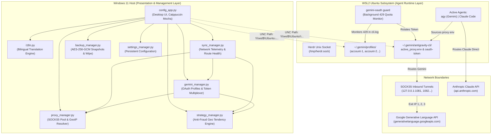

# 🏛️ Herdr Control Center — System Architecture & Module Reference

> **Document Version:** 1.0.0  
> **Target Audience:** Core Developers, AI Coding Assistants, System Architects  
> **Operating Environment:** Windows 11 Host + WSL2 (Ubuntu Linux)  

---

## 1. Executive Summary & Core Mission

**Herdr Control Center** is a hybrid desktop orchestration framework and network gateway designed for multi-agent LLM systems (Google Antigravity `agy`, Anthropic Claude Code, and custom autonomous agents).

### The Primary Problems It Solves:
1. **Gemini Cost & Quota Barrier:** Standard Gemini API keys incur high metered token costs. Google AI Pro / Gemini Advanced subscriptions provide massive web quotas via OAuth tokens. This software manages native OAuth sessions without paid API keys.
2. **Anti-Ban IP Isolation:** Google fraud detection tracks accounts accessing AI services from identical residential IP addresses. Herdr enforces strict **per-account SOCKS5 port isolation** (`1081`, `1082`, `1083`...).
3. **Automated Quota Failover:** When an account hits an HTTP `429 Too Many Requests` or `RESOURCE_EXHAUSTED` threshold during long unattended runs, the system automatically rotates to the next authorized profile and updates network routing without killing running jobs.
4. **Split Routing (Gemini SOCKS5 vs. Claude Direct):** Google Gemini traffic is tunneled through dedicated proxy ports, while Anthropic Claude traffic is routed directly through the host's clean, original residential IP to avoid Cloudflare/Anthropic proxy blocks.
5. **Bare-Metal Disaster Recovery:** All Windows configs and Linux WSL2 profile tokens can be sealed into an AES-256-GCM encrypted snapshot (`.hbak`) and restored to a fresh operating system in one click.

---

## 2. High-Level System Architecture



---

## 3. Comprehensive Module Breakdown

### 3.1. `config_app.py` — Graphical User Interface & Orchestrator
- **Role:** Presentation layer, state dispatcher, and desktop coordinator.
- **Key Responsibilities:**
  - **Single-Instance Enforcement:** Binds a loopback TCP socket on port `38123`. If an instance is already running, sending `b"SHOW\n"` brings the existing window to the foreground and exits the duplicate process.
  - **System Tray Integration:** Built using `pystray` and `Pillow`. Closing the main window minimizes the application to the notification area; double-clicking or right-clicking restores it.
  - **Asynchronous Telemetry:** Spawns daemon threads for network ping tests, profile token verification, and scheduled backups to keep the Tkinter UI responsive (60 FPS, no freezing).
  - **Live Dynamic Re-Rendering (`rebuild_ui`):** When switching languages in the Localization tab, all active frames, treeviews, and widgets are destroyed and reconstructed on the fly in ~20ms.
- **Key Methods:**
  - `_build_ui()`: Creates header, 6 navigation tabs, page container, and footer.
  - `switch_page(page_id)`: Controls active tab visibility and initiates data rendering.
  - `rebuild_ui()`: Re-renders the entire application when language changes.
  - `on_wipe_all_data()`: Triggers two-step confirmation modal for factory reset.

---

### 3.2. `i18n.py` — Internationalization & Bilingual Engine
- **Role:** Centralized dictionary and localization provider.
- **Key Responsibilities:**
  - **Complete Parallel Dictionaries:** Houses full translations for **English (`en`)** and **Russian (`ru`)**.
  - **Default Setting:** English (`en`) is the default language out of the box.
  - **Safe String Formatting:** `t("key", **kwargs)` safely formats parameterized messages (ports, latency values, timestamps, error descriptions) and falls back to English or the raw key if a translation is missing.
  - **State Persistence:** Reads and writes the active language to `settings.json` via `settings_manager`.

```python
# Usage Example
from i18n import t

label_text = t("route_gemini_active", port=1081)
# Output (en): "● Dedicated SOCKS5 active • 127.0.0.1:1081 operational"
# Output (ru): "● Персональный SOCKS5 активен • 127.0.0.1:1081 работает корректно"
```

---

### 3.3. `sync_manager.py` — Network Health & Telemetry Engine
- **Role:** Network probing, latency analysis, and split-route verification.
- **Key Responsibilities:**
  - **Port Availability:** Tests local socket readiness (`127.0.0.1:port`) with non-blocking timeouts.
  - **Gemini Health Probe:** Issues an HTTPS GET request to `https://generativelanguage.googleapis.com` through the currently active account's SOCKS5 tunnel (`socks5h://127.0.0.1:{active_port}`), calculating round-trip latency.
  - **Claude Health Probe:** Direct HTTPS probe to `https://api.anthropic.com` without proxy, validating that Claude Code bypasses proxies.
  - **WSL2 Interop:** Queries the Herdr CLI multiplexer in WSL2 to parse active agent panes (`agy`, `claude`, `bash`) and their real-time operational status.
  - **Automatic Failover Trigger:** If the Gemini tunnel fails during a check and `auto_proxy_failover` is enabled, it invokes `gemini_manager.handle_proxy_failover()` to re-route immediately.

---

### 3.4. `proxy_manager.py` — SOCKS5 Tunnel Pool & Geolocation Resolver
- **Role:** Storage, allocation, and diagnostic probing of inbound SOCKS5 proxies.
- **Key Responsibilities:**
  - **Auto-Increment Allocation:** New accounts automatically claim the next sequential port starting from `1081` (`1081`, `1082`, `1083`...).
  - **Persistence:** Maintains `proxies.json` in the application root.
  - **Strict Pagination:** Implements deterministic 10-row page chunking (`PAGE_SIZE = 10`).
  - **Geolocation & Exit IP Lookup:** Connects through the SOCKS5 proxy to `api.ipify.org` to detect the external IP, then queries `ip-api.com/json/{ip}` to retrieve the exit country. If geolocation fails, returns `"undefined"` to prevent false data.
- **Data Model (`proxies.json`):**
```json
[
  {
    "id": 1,
    "host": "127.0.0.1",
    "port": 1081,
    "label": "Gemini: Profile 1",
    "status": "online",
    "ip": "203.0.113.1",
    "country": "Finland",
    "latency_ms": 757,
    "last_checked": "02:15:30"
  }
]
```

---

### 3.5. `gemini_manager.py` — OAuth Session Multiplexer & WSL2 Interop
- **Role:** Google OAuth token storage, claim decoding, environment injection, and daemon management.
- **Key Responsibilities:**
  - **Dynamic WSL2 Detection:** Resolves the WSL Linux username via `wsl whoami` (with fallback to environment variables), ensuring portability across different computers without hardcoded paths.
  - **UNC Filesystem Access:** Interacts with the Linux filesystem from Windows using UNC network paths:
    - `\\wsl$\Ubuntu\home\<user>\.gemini\profiles\` (Account storage)
    - `\\wsl$\Ubuntu\home\<user>\.gemini\antigravity-cli\antigravity-oauth-token` (Active token)
    - `\\wsl$\Ubuntu\home\<user>\.gemini\antigravity-cli\active_proxy.env` (Environment injection)
  - **Offline JWT Decoding:** `parse_jwt_claims()` extracts the user's email, name, and expiration timestamp directly from the payload without network calls.
  - **1-Click Profile Swapping (`activate_profile`):** Copies the selected profile's OAuth token to the active token file and rewrites `active_proxy.env` with the assigned port:
    ```bash
    export ALL_PROXY="socks5h://127.0.0.1:1081"
    export HTTPS_PROXY="http://127.0.0.1:1081"
    export HTTP_PROXY="http://127.0.0.1:1081"
    ```
  - **Background Quota Daemon (`gemini-oauth guard`):** Starts and stops the WSL daemon that parses `cli.log` for HTTP 429 quota exhaustion errors.

---

### 3.6. `strategy_manager.py` — Anti-Fraud Geolocation Strategy Engine
- **Role:** Historical analysis, telemetry logging, and regional compliance scoring.
- **Key Responsibilities:**
  - **Connection Duration Telemetry:** Continuously tracks and accumulates total connection duration for each account and exit IP in `strategy_history.json` (capped at 1,000 entries).
  - **Duration-Based Geolocation Preference:** Calculates regional preference based on **cumulative active connection time** (rather than count of sessions), identifying the true predominant country.
  - **Recommendation Algorithm:**
    - `🟢 Optimal (Consistent)`: Current proxy country matches the account's historical connection time (>50% duration). Low ban risk.
    - `🟡 Nice to change`: Current proxy is in a different country than typical for this account. Recommends switching to avoid Google fraud flags.
    - `⚪ Baseline Mode`: Insufficient connection time history (<2 minutes).
  - **Backup & Restore Resilience:** Includes automated schema repair and backward compatibility for archive backups (migrating older records lacking duration metrics).
  - **1-Click Route Realignment:** Provides a button in the GUI to immediately switch the profile's tunnel to an operational proxy located in its preferred country.

---

### 3.7. `backup_manager.py` — Encrypted Bare-Metal Snapshots & Factory Reset
- **Role:** Military-grade disaster recovery, automated timers, and full data purge.
- **Key Cryptographic Specs:**
  - **Cipher:** AES-256-GCM (Authenticated Encryption with Associated Data).
  - **Key Derivation:** PBKDF2-HMAC-SHA256 with 600,000 iterations.
  - **Salt / Nonce:** 16-byte cryptographically secure random salt, 12-byte random nonce per backup.
  - **Magic Header:** `b"HBAK\x01"` (Version 1 container format).
- **Scope of Backup Archive:**
  - Windows files: `.env`, `settings.json`, `proxies.json`, `strategy_history.json`.
  - WSL2 Linux files: `~/.gemini/profiles/`, `antigravity-oauth-token`, `active_proxy.env`, `active_profile.json`.
- **Scheduled Automated Backups:** Background worker evaluates elapsed time against `backup_interval_hours` and writes snapshots to `%USERPROFILE%\Documents\HerdrBackups`.
- **⚠️ Danger Zone (`wipe_all_data`):** Safely terminates WSL daemons, purges all OAuth profiles and session tokens in WSL2, wipes strategy history, resets `.env` and `proxies.json` to default templates, and clears local logs.

---

### 3.8. `settings_manager.py` — Configuration & State Persistence
- **Role:** Reading, writing, and synchronizing persistent user settings.
- **Key Responsibilities:**
  - Reads and updates `settings.json`.
  - Automatically mirrors settings into WSL2 at `~/.gemini/antigravity-cli/settings.json`.
  - Manages flags:
    - `"language"`: Default `"en"`.
    - `"auto_proxy_failover"`: Default `True`.
    - `"auto_refresh_routes"`: Default `True`.
    - `"auto_backup_enabled"`: Default `False`.

---

## 4. Inter-Module Dependency Matrix

| Module | Depends On | Depended On By |
|---|---|---|
| `config_app.py` | `i18n`, `sync_manager`, `proxy_manager`, `gemini_manager`, `strategy_manager`, `backup_manager`, `settings_manager` | *(Entry Point)* |
| `i18n.py` | `settings_manager` | `config_app` |
| `sync_manager.py` | `gemini_manager`, `proxy_manager`, `strategy_manager`, `settings_manager` | `config_app` |
| `proxy_manager.py` | *(Standard Library, requests)* | `config_app`, `sync_manager`, `gemini_manager`, `backup_manager` |
| `gemini_manager.py` | `proxy_manager`, `strategy_manager` | `config_app`, `sync_manager` |
| `strategy_manager.py` | *(Standard Library)* | `config_app`, `sync_manager`, `gemini_manager` |
| `backup_manager.py` | `cryptography` | `config_app` |
| `settings_manager.py` | *(Standard Library)* | `config_app`, `i18n`, `sync_manager` |

---

## 5. Data Flow Workflows

### 5.1. Normal LLM Request Flow (Split Routing)

```
[User Agent (WSL2)]
       │
       ├──> Gemini Request ➔ reads active_proxy.env ➔ SOCKS5 :1081 ➔ Google AI Endpoints (Proxied IP)
       │
       └──> Claude Request ➔ direct connection ➔ api.anthropic.com (Direct Residential IP)
```

### 5.2. Quota 429 Failover Sequence

```
1. Agent hits HTTP 429 Quota Exhausted on Google API
2. WSL2 gemini-oauth guard daemon catches error in cli.log
3. Guard calls: gemini-oauth next
4. Active profile token file replaced with Profile 2 token
5. active_proxy.env rewritten to export ALL_PROXY="socks5h://127.0.0.1:1082"
6. Windows GUI sync_manager detects route change on next cycle (30s)
7. GUI reflects active account switch and updates strategy analytics
```

### 5.3. Bare-Metal Snapshot Export & Import

```
[Export]
Host Files + WSL2 Tokens ➔ In-Memory ZIP ➔ PBKDF2 Key Derivation ➔ AES-256-GCM Encryption ➔ *.hbak File

[Import]
*.hbak File ➔ Read Salt & Nonce ➔ Master Password Key Derivation ➔ AES-256-GCM Decrypt ➔ Extract & Restore Host + WSL2 Paths
```

---

## 6. How to Extend the Codebase

### Adding a New Display Language:
1. Open [`i18n.py`](file:///D:/My%20files/herdr_control_center/i18n.py).
2. Add a new dictionary under `TRANSLATIONS["de"]` or your target language code.
3. In `_build_page_localization` in [`config_app.py`](file:///D:/My%20files/herdr_control_center/config_app.py), add a radio button card for the new language.

### Supporting Additional AI Providers:
1. In `sync_manager.py`, add endpoint definition and ping test function (e.g. `check_openai_route`).
2. In `config_app.py`, add a route card in `_build_page_routes`.
3. If proxying is needed, bind an additional isolated port via `proxy_manager.py`.

---

## 7. Compilation & Packaging Instructions

To build a standalone Windows binary (`HerdrControlCenter.exe`) including all embedded dependencies:

```cmd
cd "D:\My files\herdr_control_center"
python -m pip install -r requirements.txt
python -m pip install pyinstaller
pyinstaller --noconsole --onefile --name HerdrControlCenter --hidden-import=cryptography --hidden-import=pystray --hidden-import=PIL --hidden-import=requests --hidden-import=socks --hidden-import=dotenv --hidden-import=tkinter --hidden-import=i18n config_app.py
```

The resulting 25 MB executable is self-contained and ready for distribution via GitHub Releases.
