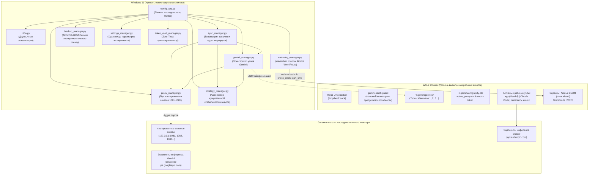

# 🏛️ Herdr Research Control Center — Архитектура распределённого бенчмарк-кластера

> **Версия спецификации:** 2.0.0 (Research Edition)  
> **Цель проекта:** Эмпирическое исследование эффективности ансамблей распределённых сабагентов против монолитных моделей  
> **Среда выполнения:** Windows 11 Host + WSL2 (Ubuntu Linux)  

---

## 1. Исследовательская миссия и цели проекта

Платформа **Herdr Research Control Center** спроектирована как исследовательский полигон для верификации гипотезы:
> **Гипотеза:** *Координированная работа группы специализированных сабагентов (worker nodes) в независимых сетевых топологиях обеспечивает превосходящую точность, меньшую дисперсию задержек и повышенную суммарную пропускную способность по сравнению с одиночной монолитной моделью.*

### Инженерные задачи, решаемые архитектурой:
1. **Чистота экспериментальных замеров (Zero Contamination):** Каждый рабочий узел ансамбля закрепляется за отдельным локальным сокетом (порты `1081`, `1082`, `1083`...). Это устраняет влияние очередей сокетов хоста на метрики задержки (TTFT и TPS).
2. **Исследование географической вариативности инференса:** Маршрутизация запросов через узлы в разных регионах (Финляндия, Франция и др.) позволяет изучать влияние географического распределения дата-центров на стабильность генерации.
3. **Автоматическая балансировка при стресс-тестах:** При проведении многочасовых бенчмарков с тысячами итераций исчерпание лимитов пропускной способности отдельного узла автоматически компенсируется переключением на соседний резервный узел по алгоритму Round-Robin без прерывания эксперимента.
4. **Специализированная маршрутизация потоков:** Потоки запросов к Gemini и Claude маршрутизируются по индивидуальным калиброванным каналам для независимой оценки их сильных сторон в мультиагентных графах AionUi.
5. **Детерминированное воспроизведение стенда (Golden Snapshots):** Полный снимок конфигурации узлов и зашифрованных артефактов фиксируется в криптографическом архиве (`.hbak`, AES-256-GCM) для точного воспроизведения условий эксперимента на других машинах.

---

## 2. Структура слоёв архитектуры

---

## 3. Описание модулей

### `config_app.py`
Ядро визуализации. Предоставляет исследователю панель приборов с интерактивными графиками телеметрии, состоянием сессий узлов, кумулятивным временем работы и переключателями тестовых конфигураций.

### `token_vault_manager.py`
Модуль обеспечения целостности экспериментальных артефактов. Все ключи и токены хранятся с применением стандарта AES-256-GCM в файлах `.enc`. Расшифровка происходит в изолированном контексте исключительно на время сетевого вызова. Предусмотрена обработка прерываний сетевого ввода-вывода WSL UNC (`WinError 995`).

### `gemini_manager.py`
Оркестратор пула тестовых узлов Gemini. Автоматически закрепляет рабочие узлы за локальными сокетами, начиная с базового порта 1081. Ведёт учёт времени жизни токенов и проверяет их доступность перед запуском бенчмарк-прогонов.

### `strategy_manager.py`
Аналитический модуль сетевой стабильности. Вместо подсчета разовых подключений оценивает **кумулятивную продолжительность стабильного соединения** каждого узла. Это позволяет выявлять наиболее устойчивые региональные маршруты для длительных нагрузочных тестов.

### `watchdog_manager.py` (aiWatcher)
Встроенный сторож сервисов WSL2, бывшее отдельное приложение `D:\My files\aiWatcher`. `WatchdogService` в фоновом потоке каждые `interval` секунд выполняет для каждого сервиса `check_cmd` и при неудаче `start_cmd` (через `wsl.exe bash -lc`, таймаут 30 с). Защиты: период прогрева против двойного запуска, флаг обслуживания `~/.aionui-web/.maintenance`, пауза при обнаружении внешнего aiWatcher. События передаются в GUI через `queue.Queue`, и карточка «aiWatcher» на странице «Маршруты» обновляется только в главном потоке Tk. Конфиг `watchdog_config.json` пишется атомарно. Опрос Herdr Multiplexer (`sync_manager.probe_herdr_wsl`) из цикла проверки маршрутов убран вместе с его карточкой. Документация: [docs/AIWATCHER.md](docs/AIWATCHER.md).

### `integrations_manager.py`
Мост интеграции с AionUi и OmniRoute. Автоматически прописывает топологии мультиагентных комбо (`gemini-farm`) в `storage.sqlite` OmniRoute, связывая сокеты `1081..1085` с конкретными профилями для round-robin балансировки.
